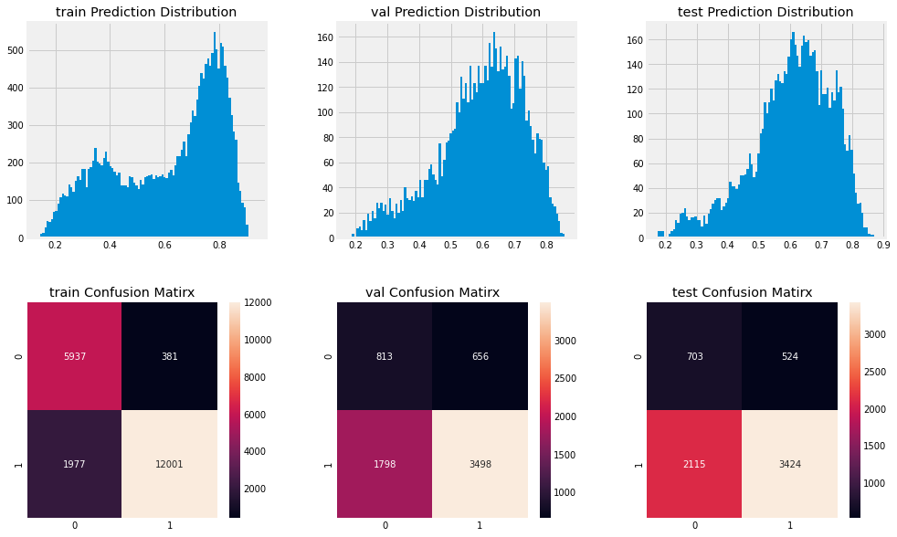

# Algothon2021

For [http://www.algothon.org/index.html](http://www.algothon.org/index.html)

Joint work with [github.com/chrischia06](https://github.com/chrischia06), [github.com/san909/](https://github.com/sanj909), and [github.com/faridabj/](https://github.com/faridabj/), as **TeamTBA**.

Placed overall 6th out of 40 teams.	

## Structure

All Challenges are from: [http://www.algothon.org/challenges.html](http://www.algothon.org/challenges.html), and the data they have provided is [here](https://drive.google.com/drive/folders/180FaVThDIFtmrCZ2cGiYskvlyvyMv5Au)

### Data Cleaning Challenge

Task was to clean a timeseries dataset, with the private leaderboard metric being the MSE of the cleaned dataset against the the true values. Rank: 11.

### Dashboard

Task was to build a dashboard to visualise the data from the data cleaning challenge. Rank: 11.

[https://teamtba.herokuapp.com/](https://teamtba.herokuapp.com/)

### Machine Learning Strategy Challenge

Task was to collect external data to predict returns for a dataset of trades (only anyonymised asset, date, and trade returns), and an action between [-1, 1], with the metric being the backtest Sharpe ratio. See `MLStrat/` [here](#MLStrat/) for more details. Rank: 7.

### Prediction Challenge

Task was to predict an action between [-1, 1] based on the next 20-day log return, with the metric being the backtest sharpe. See `PredictionChallenge/` [here](#PredictionChallenge/) for more details. Rank: 3.

### ESG challenge

Task was to devise a tracking portfolio for the S&P500, at each timestep only using the stocks with a high ESG score. *Note: we just used 1/N, but from the organisers, the best teams used the asset's weight in the S&P500, which was a feature provided* Rank: 11.

### Long-Short Challenge

Task was to devise a mutli-asset long short strategy for a particular sector. See `LongShort/` [here](#LongShort/)  for more details. The leaderboard metric was Cumulative Returns - 0.5 * Max Drawdown. Rank: 8.

### Latency Challenge

Task was to build a classifier with greater than 50% accuracy that predicts, with the minimum latency among competitotrs Rank: 6. *Note: Used Python instead of C++, which is a potential improvement.* See `LatencyChallenge/` [here](#LatencyChallenge/) for more details.

